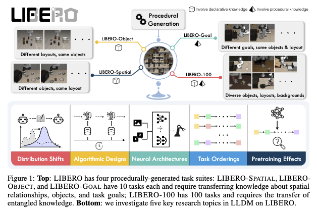

# LIBERO: Benchmarking Knowledge Transfer for Lifelong Robot Learning 논문 리뷰

#### NeurIPS 2023 (oral presentation at RAP4Robots, ICRA 2023, and TGR, CoRL 2023)

### Selection Reason:

- 표면적: Continual Reinforcement Learning 관련 주제 탐색중, 이를 Benchmarking하기 위한 Task 환경이 없을까해서 읽음

- 내면적: 2023년 논문인데 41회나 인용됨. 로봇, 멀티에이전트 시스템의 대가, [Peter Stone](<https://en.wikipedia.org/wiki/Peter_Stone_(professor)>)이 저자.

### Author Information

#### First: [Bo Liu](https://cranial-xix.github.io/)

최근 1저자 논문명

1. Longhorn: State Space Models Are Amortized Online Learners (Oral presentation at ENLSP@NeurIPS 2024)
2. Communication Efficient Distributed Training with Distributed Lion (NeurIPS 2024)
3. LLM+P: Empowering Large Language Models with Optimal Planning Proficiency

#### Last: [Peter Stone](<https://en.wikipedia.org/wiki/Peter_Stone_(professor)>)

최고 citation papers:

1. [Transfer learning for reinforcement learning domains: A survey.](https://scholar.google.com/citations?view_op=view_citation&hl=en&user=qnwjcfAAAAAJ&citation_for_view=qnwjcfAAAAAJ:kNdYIx-mwKoC), 2009
2. [Deep recurrent q-learning for partially observable mdps](https://scholar.google.com/citations?view_op=view_citation&hl=en&user=qnwjcfAAAAAJ&citation_for_view=qnwjcfAAAAAJ:g8uWPOAv7ggC), 2015
3. [Multiagent systems: A survey from a machine learning perspective](https://scholar.google.com/citations?view_op=view_citation&hl=en&user=qnwjcfAAAAAJ&citation_for_view=qnwjcfAAAAAJ:u5HHmVD_uO8C), 2000

## Abstract

Generalist agent의 학습(learning)과 적응(adapting)을 위해여 Lifelong learning 패러다임을 연구해야 한다. 더 구체적으로는 강화학습과 연관지어 환경과 작용하고 행동을 선택하는 _lifelong learning in decision-making_ (**LLDM** )을 해결하는 모델을 만들어야 하는데, 이의 지식 transfer의 능력을 세분화하여 정량적으로 평가하고 확장가능한 환경이 부족하다.

따라서 이 논문은 **LIBERO** 환경을 제시한다. 저자가 제시한 이 환경에서 세분화하여 평가하는 요소는 다음과 같다.

1. How to efficiently transfer knowledge (환경 특성)
   - Declarative Knowledge (high-level의 어느정도 추상적인 정보)
   - Procedural Knowledge (low-level의 구체적인 행위에 대한 정보)
   - Mixture of both
2. How to design effective policy architectures (RNN, ViT등의 비교)
3. Effective Algorithm for LLDM (ER, EWC, PackNet)
4. The robustness of lifelong learner with respect to task ordering(환경특성)
5. The effect of model pretraining for LLDM

## Introduction

### Tasks

저자는 LLDM의 knowledge transfer를 명확한 측정을 위해, knowledge를 두 종류로 나눈 후, 한 종류만 고정하는 통제 환경 및 두 조건을 다 바꾸는 다변수 환경을 만들었다.

- Declarative Knowledge (high-level의 어느정도 추상적인 정보)
- Procedural Knowledge (low-level의 구체적인 행위에 대한 정보)

만약 후라이팬을 버너 위에 올리는 task가 있다 가정하자. 초기 후라이팬의 위치는 고정 되었지 않다면,
"후라이팬을 버너 위에 올려야 된다"는 high level의 Declarative Knowledge은 변하지 않지만,
초기 후라이팬 위치에 따라 움직여야 하는 low level의 근육의 Procedural Knowledge은 변한다.

이러한 지식의 종류를 변수로 설정하여 LIBERO는 모델의 부족한 지식 전달 방법을 정확하게 평가할 수 있다.

#### Environments

- LIBERO-Object (Different layouts, same objects) Declarative Knowledge transfer 평가
- LIBERO-Spatial (Different object, same layout) Procedural Knowledge transfer 평가
- LIBERO-Goal (Different goals, same objects & layout) 둘다 transfer 평가
- LIBERO-100 (Diverse objects, layouts, background) (YOLO)

\*\* 잘 생각해보면 Declarative Knowledge transfer 평가는 새로운 Procedural Knowledge에 대한 adaptability를 평가하는 것이랑 같다.

## Background and Architecture

### Math

MDP is defined as $\mathcal{M} = (\mathcal{S}, \mathcal{A}, \mathcal{T}, H, \mu_0, R)$ s.t

- $\mathcal{S}, \mathcal{A}$ are the state and action spaces of the robot
- $\mu_0$ is the initial state distribution (시작 물건 위치가 랜덤성이 있기 때문)
- $\mathcal{R} : \mathcal{S} \times \mathcal{A} \rightarrow \mathbb{R}$ is the reward function
- $\mathcal{T}: \mathcal{S} \times \mathcal{A} \rightarrow \mathcal{S}$ is the transition function
  In this work, assume
- sparse reward setting
- replace $R$ with goal predicate $g : \mathcal(S) \rightarrow \{0, 1\}$
  so the expected return is
  $J(\pi) = \mathbb{E}_{s_t, a_t ~ \pi, \mu_0}[\sum_{t=1}^H(g(s_t)]$

The _lifelong robot learning problem_ can be defined using

- $K$ tasks $\{T^1, \dots, T^k\}$
- policy
  $\pi$ is conditioned on the task $\pi (\cdot | s;T)$
- $T^k = (\mu_0^k, g^k)$
  The robot aims to optimize
  $$\max_{\pi} J_{LRL}(\pi) = \frac{1}{k}\sum_{p=1}^k\bigg[ \mathbb{E}_{s_t^p, a_t^p ~ \pi(c\dot ; T^p), \mu_0^p }\big[\sum_{t=1}^L g^p(s_t^p)\big] \bigg]$$

Also, this paper used _Imitation Learning_ for inducing search space similar to the demonstration

- Denote $D^k = \{ \tau_i^k\}_{i=1}^N$ as $N$ demonstrations for task $T^k$
- $\tau_i^k = (o_0, a_0, o_1, a_1, \dots, o_{l^k})$ where $l^k \leq H$
- To induce MDP from non-Markovian env, $s_t$ is represented by aggregated history of observations,  
  $s_y \equiv o_{\leq t} = (o_0, o_1, \dots, o_t)$
- Behavior cloning loss is
  $$min_\pi J_{BC}(\pi) = \frac{1}{k}\sum^k_{p=1} \mathbb{E}_{o_t, a_t ~ D^p} \bigg[ \sum_{t=0}^{l^p} \mathcal{L}(\pi(o_{\leq t}; T^p), a_t^p) \bigg]$$

### Non-math

LIBERO 는 Procedurally generation으로 다음과 같이 동작함.

1. [Ego4D](https://ego4d-data.org/) 데이터 셋을 이용한 템플렛 및 language annotations 추출
2. [PPDL](https://en.wikipedia.org/wiki/Planning_Domain_Definition_Language) 언어를 통한 구체화된 시작 분포 $\mu_0$ 형성
3. goal 명시화

- _unary predicates_ (한 물건의 상태 e.g. Open($X$), TurnOff($X$))
- _binary predicates_ (물건 간의 상태 e.g. On($A$, $B$)

## Experiment

### Searching Space

#### Algorithms

- Experience Replay(ER)
- Elastic Weight Consolidation (EWC)
- PackNet (SOTA)

#### Neural Network Architectures

- ResNet-RNN
- ResNet-T (Transformer decoder)
- Vit-T

### Evaluation Metric

- Forward Transfer (FWT), higher better
  $FWT = \sum_{k \in [K]} \frac{FWT_k}{K}, FWT_k = \frac{1}{11} \sum_{e \in \{ 0 \dots 50\} c_{k,k,e}}$
  average success rates of current task $k$ across multiple epochs

- Negative backward transfer (NBT), lower better
  $NBT = \sum_{k \in [K]} \frac{NBT_k}{K}, NBT_k = \frac{1}{K-k}\sum^K_{\tau=k+1}(c_{k,k}-c_{\tau, k})$
  average of future agents best score across training epochs

- AUC (combination), higher better
  $AUC = \sum_{k \in [K]}\frac{AUC_k}{K}, AUC_k = \frac{1}{K-k+1}(FWT_k + \sum^K_{\tau = k+1}c_{\tau, k})$

## Findings

**Q1**: How do different architectures/LL algorithms perform under specific distribution shifts
**Q2** To what extent does neural architecture impact knowledge transfer in LLDM, and are there any discernible patterns in the specialized capabilities of each architecture?
**Q3** How do existing algorithms from lifelong supervised learning perform on LLDM tasks?
**Q4** To what extent does language embedding affect knowledge transfer in LLDM?
**Q5** How robust are different LL algorithms to task ordering in LLDM?
**Q6** Can supervised pretraining improve downstream lifelong learning performance in LLDM?

### Q1, Q2

ResNet-T and Vit-T work much better than ResNet-RNN on average.
Different algorithms also showed different preferences for neural architecture. mainly in SOTA PackNet mode, while VIT-T showed better forward transfer metric, the ResNet-T model showed better negative backward transfer.

However, the VIT-T performance dropped when using a simpler ER algorithm. as shown in table 1.

### Q1, Q3

When comparing four different task environments with the same ResNet-T architecture(selected due to it having stable performance across learning algorithms), sequential finetuning (SeQL) whoed the best FWT. Although the SOTA PackNet model showed better performance to ER in LIBERO-X it is outperformed by ER in LIBERO-Long due to low FWT. This means that splitting the network into smaller networks hurts its learning capacity.

### Q4

Task embeddings does not seem to change much of the result!

### Q5

Task ordering is important in continual reinforcement learning!

### Q6

Pretraing is likely to hurt the performance of continual learning agents.

## Conclusions

논문의 작성 이유가 명확하고, 실험의 결과를 보여줄때도 미리 유의미할 것이라 가설을 세운 부분들을 살펴보며 각 의문 마다 답하는 형식을 택한게 설명이 명확하여 좋았다.
직관과 다르게 Language embedding 과 pre training은 그닥 효과가 좋지 못하거나 오히려 성능을 저하시키는 일을 한다.
트랜스포머 아키텍처는 예상과 비슷하게, 데이터가 유의미하게 많은 상황에서 학습이 잘된다. 이를 위해서는 학습 알고리즘이 더 복잡해야 할 수 도 있다.
모델 안을 여러 네트워크로 구성하는 방법은 각 테스크가 간단하다면 유요한 방법이지만, 지식( Declarative Knowledge, Procedual Knowledge)을 구별하여 이전의 task의 정보를 이용해야 한다면 한계점이 클 수 있다.

## Future Work

논문은 continual learning을 위해 전달 되어야하는 지식이 Declarative Knowledge, Procedual Knowledge으로 나누어 질 수 있다는 것에 착안하여 이를 독립적으로 구별할 수 있는 확장 가능한 환경을 만들었다. 또한 이러한 환경에서 알고리즘과 아키텍처 두 축을 잡아 어느정도의 searching을 하였다.
그러면 논문에 나온

- NN 아키텍처 또는 Learning algorithm의 한계를 더 명확하게 알 수 있는가?
  - 수식적으로 증명 가능한가?
  - 더 세분화 된 실험을 통해 설명 할 수 있는가?
- Continual Learning Agent를 구현한다 하였을때
  - 다른 알고리즘을 사용해 볼까?
  - 다른 아키텍쳐를 사용해 볼까?
  - Declarative Knowledge을 잘 전달 하는 방법은 무엇인가?
    - 수식적 증명 가능한가?
    - 실험 가능한가?
  - Declarative Knowledge을 잘 전달 하는 방법은 무엇인가?
    - 수식적 증명 가능한가?
    - 실험 가능한가?

무엇을 사용해볼까?

- High-level 하고 low-level를 분리하여 계층적인 RL 알고리즘은 없는가?

## 공부할 것

[Experience Replay](https://arxiv.org/abs/1902.10486)
[Elastic Weight Consolidation](https://arxiv.org/abs/1612.00796)
[PackNet](https://arxiv.org/abs/1711.05769)

> Written with [StackEdit](https://stackedit.io/).
